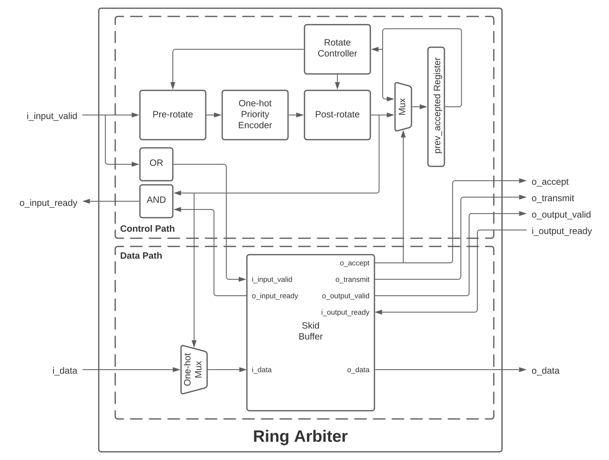

.. _ring-arbiter:

============
Ring Arbiter
============

A ring arbiter is a many-to-one flow control block that accepts transactions from 2 or more input ports and
provides that data to an output interface. If more than 1 input port is ready to send data, the ring arbiter
will arbitrate between all active input ports by accepting 1 transaction from each input port, in port order,
so that no input port is allowed to transmit two transactions in a row as long as there is at least one
other input port that is waiting to send a transaction.

This implementation is pipelined from input to output so that back-to-back transfers are achieved, thus
allowing for sustained maximum data throughput to the output interface. As shown in the figure below,
the core of the control path design of the ring arbiter consists of two :ref:`rotate` blocks, a
:ref:`one-hot-priority-encoder`, and a rotate controller. The pre-:ref:`rotate` +
:ref:`one-hot-priority-encoder` + post-:ref:`rotate` combination determines which input port will be serviced
next while the rotate controller calculates the rotation amounts such that the last accepted input port is
the lowest priority input port until a new transaction is accepted from a different input port, thus changing
the last accepted input port. Therefore, the prev_accepted register is only written when the
:ref:`skid-buffer` indicates that it has accepted a new transaction from an input port.

The datapath for the ring arbiter consists of a :ref:`one-hot-mux` and a :ref:`skid-buffer`. The
:ref:`one-hot-mux` selects the data from the input port that has been decided by the control path so that th
:ref:`skid-buffer` sees the correct input port's data at its input. On the output, the :ref:`skid-buffer`'s
output is connected directly to the output interface. The :ref:`skid-buffer` is used here because it provides
the back-to-back transfers needed on a pipelined interface in a fairly lightweight manner.

Parameters
----------
- ``PORTS`` : number of input ports each of ``DATA_WIDTH`` bits
- ``DATA_WIDTH`` : data width per input port in bits

Ports
-----
- ``i_clock`` : input clock
- ``i_aresetn`` : asynchronous active-low reset
- ``i_clear`` : synchronous clear
- ``i_data`` : input data of all ports concatenated into a single vector (size is ``PORTS*DATA_WIDTH`` bits)
- ``i_input_valid`` : valid signals from all input ports. Used with o_input_ready for input handshaking
- ``i_output_ready`` : ready signal from output interface. Used with o_output_valid for output handshaking
- ``o_data`` : output data (size is ``DATA_WIDTH`` bits)
- ``o_output_valid`` : valid signal from output interface. Used with i_output_ready for output handshaking
- ``o_input_ready`` : ready signals to all input ports. Used with i_input_valid for input handshaking
- ``o_accept`` : accept status signal that indicates whenever input data is accepted by the ring arbiter
- ``o_transmit`` : transmit status signal that indicates whenever output data is transmitted by the ring arbiter

Source Code
-----------
.. literalinclude:: ../../libsv/arbiters/ring_arbiter.sv
    :language: systemverilog
    :linenos:
    :caption: ring_arbiter.sv
